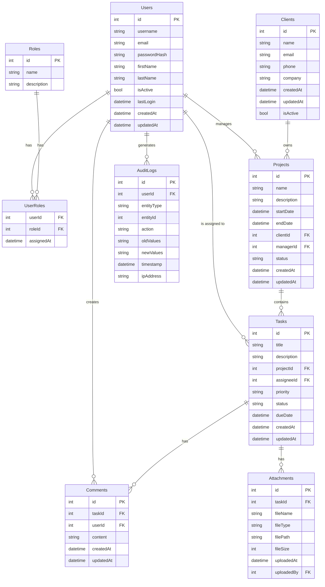

# Database Schema Visualization

This diagram shows:
1. **Core Entities**: Users, Roles, Clients, Projects, and Tasks
2. **Supporting Entities**: Comments, Attachments, and AuditLogs
3. **Junction Tables**: UserRoles for many-to-many relationships
4. **Relationships**: Shows cardinality and dependencies between entities
5. **Fields**: Essential fields for each entity including primary and foreign keys

Key Relationships:
- Users can have multiple roles (through UserRoles)
- Clients can have multiple projects
- Projects can have multiple tasks
- Tasks can have multiple comments and attachments
- All major actions are tracked in AuditLogs

The schema supports all requirements including:
- User and role management
- Client management
- Project and task tracking
- Document attachments
- Audit logging
- Comments and collaboration
